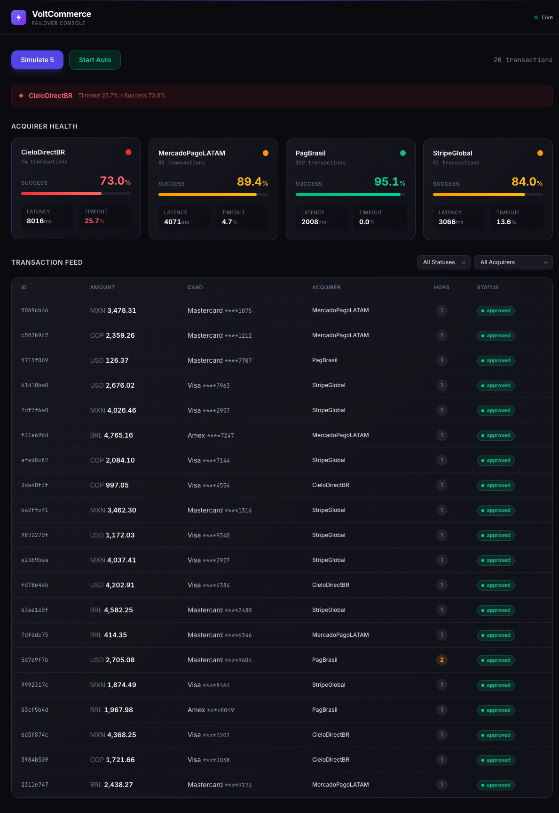
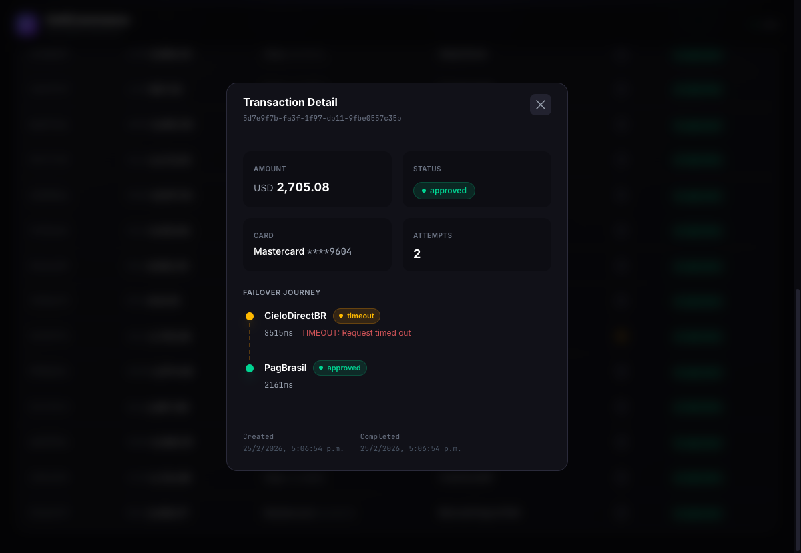
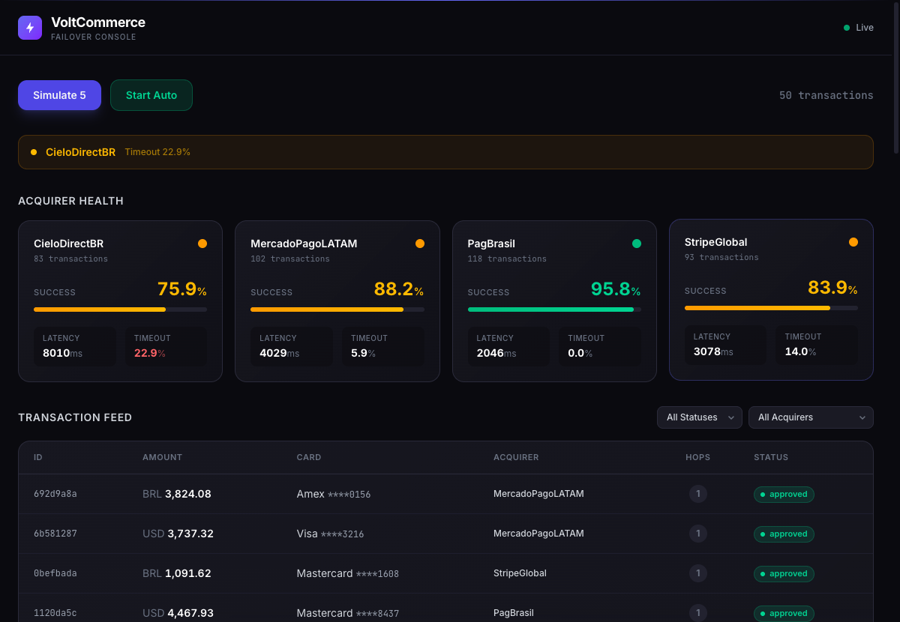
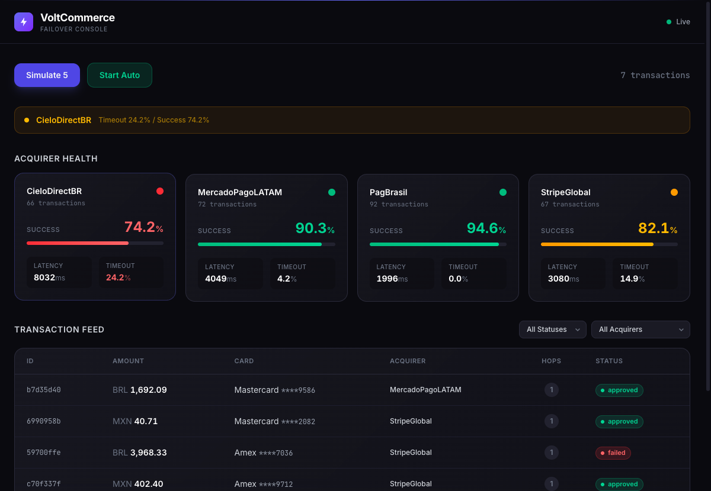
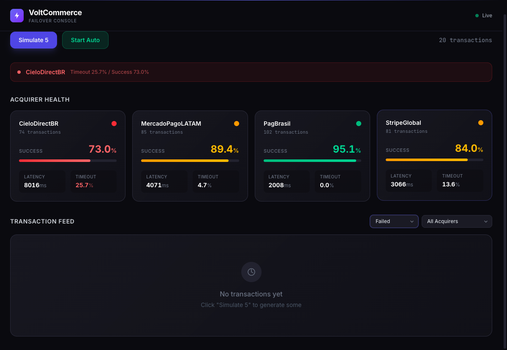

# VoltCommerce Failover Console

Real-time monitoring console for tracking payment transaction timeouts across 4 acquirers and visualizing failover behavior.

## Screenshots

| Dashboard with Metrics | Failover Detail | Alert Banners |
|---|---|---|
|  |  |  |

| Empty State | Filtered View |
|---|---|
|  |  |

## Tech Stack

- **Backend**: Go 1.21+ (stdlib `net/http`, no external dependencies)
- **Frontend**: React 19 + Vite 7 + Tailwind CSS v4
- **Fonts**: Inter (UI) + JetBrains Mono (code/data)
- **No database** — in-memory store with `sync.RWMutex`

## Getting Started

### Prerequisites

- Go 1.21+
- Node.js 18+

### 1. Clone the repository

```bash
git clone https://github.com/anfeespi/yuno-challenge.git
cd yuno-challenge
```

### 2. Start the backend

```bash
cd backend
go run .
# API running on http://localhost:3001
```

### 3. Start the frontend (in a separate terminal)

```bash
cd frontend
npm install
npm run dev
# App available at http://localhost:5173
```

## How to Trigger Transactions

### From the UI

1. Open http://localhost:5173
2. Click **"Simulate 5"** to generate 5 random transactions instantly
3. Click **"Start Auto"** to enable auto-simulation (1 transaction every 2 seconds)
4. Click **"Stop Auto"** to disable it

### From the API (curl)

```bash
# Simulate a single transaction
curl -X POST http://localhost:3001/api/simulate -d '{"count": 1}'

# Simulate a batch of 20 transactions
curl -X POST http://localhost:3001/api/simulate -d '{"count": 20}'

# Toggle auto-simulation on/off
curl -X POST http://localhost:3001/api/simulate/auto

# View all transactions
curl http://localhost:3001/api/transactions

# Filter by status
curl "http://localhost:3001/api/transactions?status=failed"

# Filter by acquirer
curl "http://localhost:3001/api/transactions?acquirer=CieloDirectBR"

# Get per-acquirer metrics
curl http://localhost:3001/api/metrics

# Get a single transaction by ID
curl http://localhost:3001/api/transactions/{id}
```

### Generating Test Data

There is no seed file required. Transactions are generated on-demand via the simulation engine with randomized parameters (amount, currency, card brand, acquirer routing). To generate a representative dataset:

```bash
# Generate 50 transactions — enough to see realistic acquirer metrics
curl -X POST http://localhost:3001/api/simulate -d '{"count": 50}'
```

With 50+ transactions you'll typically see:
- **PagBrasil** at ~95% success rate, ~2% timeout
- **CieloDirectBR** at ~70% success, ~25% timeout (triggers alert banners)
- **StripeGlobal** at ~88% success, ~8% timeout
- **MercadoPagoLATAM** at ~85% success, ~10% timeout
- Several failover scenarios where a timeout on one acquirer routes to the next

## API Endpoints

| Method | Path | Description |
|--------|------|-------------|
| `GET` | `/api/health` | Health check |
| `POST` | `/api/simulate` | Simulate transactions (`{"count": N}`, max 100) |
| `POST` | `/api/simulate/auto` | Toggle auto-simulation (every 2s) |
| `GET` | `/api/transactions` | List transactions (?status, ?acquirer, ?limit, ?offset) |
| `GET` | `/api/transactions/{id}` | Get transaction by ID |
| `GET` | `/api/metrics` | Aggregated per-acquirer metrics |
| `GET` | `/api/stream` | SSE stream (events: `transaction`, `metrics`) |

## Acquirer Profiles

| Acquirer | Success Rate | Timeout Rate | Latency | Priority |
|----------|-------------|-------------|---------|----------|
| PagBrasil | 95% | 2% | 1-3s | 1 (highest) |
| StripeGlobal | 88% | 8% | 2-4s | 2 |
| MercadoPagoLATAM | 85% | 10% | 3-5s | 3 |
| CieloDirectBR | 70% | 25% | 6-10s | 4 (lowest) |

## Architectural Decisions

### Why Go stdlib `net/http` (no framework)?
Go 1.22+ `ServeMux` supports method-based routing (`GET /api/...`) natively. No need for chi/gorilla for this scope — fewer dependencies, faster compile, zero external go.sum entries.

### Why in-memory store instead of SQLite/Postgres?
The challenge is about real-time monitoring, not persistence. `sync.RWMutex` with a capped slice (1000 txns) gives O(1) writes and simple iteration for metrics aggregation. No setup friction for reviewers.

### Why SSE instead of WebSockets?
SSE is simpler for unidirectional server→client streaming (which is all we need). Native `EventSource` API in browsers handles reconnection automatically. No extra libraries needed on either side.

### Why pre-computed simulation (no real delays)?
The simulation engine rolls random outcomes against acquirer probability profiles and assigns simulated latency values without actual `time.Sleep`. This lets us generate 100 transactions instantly while still producing realistic timing data for the UI.

### Why `useReducer` instead of Redux/Zustand?
The state shape is simple (transactions array + metrics array + auto toggle). `useReducer` keeps it local to the Dashboard component with no extra dependencies. SSE callbacks dispatch actions directly.

### Why Tailwind CSS v4?
Utility-first CSS with zero config. v4's `@theme` directive lets us define custom design tokens (surface colors, volt accent) directly in CSS without `tailwind.config.js`.

## Project Structure

```
├── README.md
├── screenshots/              # 5 screenshots demonstrating the app
├── backend/
│   ├── go.mod
│   ├── main.go               # HTTP server, CORS middleware, route wiring
│   ├── models/
│   │   └── transaction.go    # Transaction, Attempt, AcquirerProfile structs
│   ├── acquirers/
│   │   └── profiles.go       # 4 acquirer configs + routing order
│   ├── engine/
│   │   └── simulator.go      # Transaction simulation + failover logic
│   ├── store/
│   │   └── memory.go         # Thread-safe in-memory store + metrics
│   ├── handlers/
│   │   └── api.go            # REST API handlers
│   └── sse/
│       └── broker.go         # SSE broadcast manager
└── frontend/
    ├── package.json
    ├── vite.config.js
    ├── index.html
    └── src/
        ├── App.jsx
        ├── main.jsx
        ├── index.css           # Tailwind + custom theme + animations
        ├── hooks/useSSE.js     # EventSource with auto-reconnect
        ├── lib/api.js          # Fetch wrappers for all endpoints
        └── components/
            ├── Dashboard.jsx         # Main layout + state management
            ├── TransactionFeed.jsx   # Real-time transaction table
            ├── AcquirerMetrics.jsx   # 4 health cards with progress bars
            ├── TransactionDetail.jsx # Modal with failover journey timeline
            ├── StatusBadge.jsx       # Color-coded status indicators
            ├── FilterBar.jsx         # Status + acquirer dropdowns
            └── AlertBanner.jsx       # Warnings for underperforming acquirers
```
